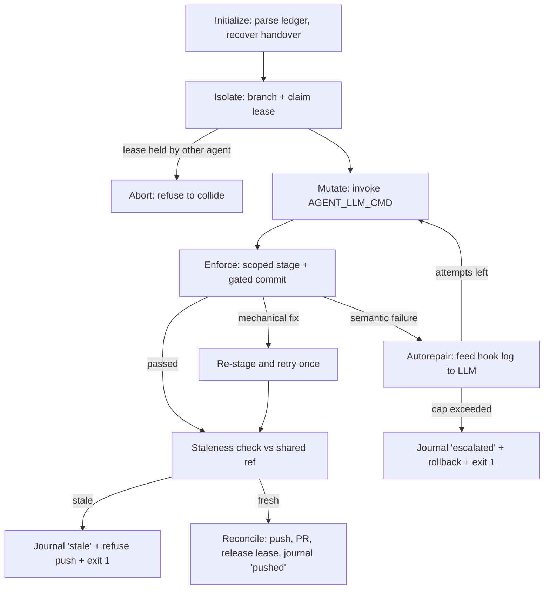

# Agent Workflow Harness

A hardened framework that keeps automated / LLM coding agents **on the rails**
using a strict five-state loop and programmatic **file-locking** enforced at
commit time. An agent may only touch the files a task explicitly declares;
everything else is locked, and the orchestrator never leaves the repository in
a half-broken state.

This README documents what is actually implemented in the repository: the
orchestrator, the file-lock and contract-binding hooks, and the cross-agent
coordination layer (leases, handover journal, shared state ref, staleness
guard).

---

## The five-state loop



| State | What it does |
|-------|--------------|
| **Initialize** | Open the repo, refuse a dirty tree, pull only if a tracking `origin` exists, parse `AGENTS.md`, reject an unsupported `schema_version`, generate / reuse an `AGENT_ID`, and recover the latest unresolved handover journal (locally and from the shared state ref). |
| **Isolate** | Record the current branch, compute a colon-free work-branch name, validate it with `git check-ref-format`, verify declared paths exist, create the branch, and **acquire a TTL'd lease** for the task (locally and on the shared state ref). A live lease held by a different agent aborts the run. |
| **Mutate** | Dispatch on `mutation_mode` (`evolve` / `isolated`) and invoke `AGENT_LLM_CMD` — a provider-agnostic shell command — with the task context and allowlist exported as environment variables. A no-op when `AGENT_LLM_CMD` is unset (the seam is honest about being inactive). |
| **Enforce** | Stage **only** the task's allowlist (POSIX-normalized), commit with `AGENT_TASK_ID` set so the lock / contract-binding hooks gate it, then classify the result as `passed` / `mechanical` / `semantic`. Every attempt is appended to the journal. |
| **Autorepair** | On a semantic failure, feed the hook log back to the LLM via `AGENT_REPAIR_LOG`. When `max_autorepair_attempts` is exceeded, journal `escalated`, **roll back** to the original branch, release the lease, and exit non-zero. |
| **Reconcile** | Run the optimistic **staleness guard** against `AGENT_SHARED_REF` (default `origin/main`); if any critical file moved since the base commit, journal `stale`, refuse the push, and exit 1. Otherwise push (when `origin` exists), open a PR via `gh` if available (or print the exact manual command), release the lease, and journal `pushed` / `local`. |

---

## Repository layout

```
dev_process/
├── AGENTS.md                          # Operational ledger (YAML): task definitions
├── agent_runner.py                    # Orchestrator: the 5-state loop
├── .pre-commit-config.yaml            # Syntax/lint/type + ledger + lock + contract hooks
├── pyproject.toml                     # ruff / mypy / pytest configuration
├── requirements.txt                   # Pinned runtime dependencies
├── conftest.py                        # Puts the flat sample-app modules on sys.path
├── .harness/                          # Harness-managed coordination state
│   ├── contracts.lock                 # Hashed manifest of every declared contract
│   ├── leases/                        # <task_id>.json — active task leases (TTL'd)
│   └── journal/                       # Append-only handover records per session
├── scripts/
│   └── hooks/
│       ├── lock_policy.py             # Shared compute_allowlist() + coordination bypass
│       ├── enforce_file_locks.py      # Pre-commit gate: aborts out-of-allowlist commits
│       ├── validate_agents_ledger.py  # Validates AGENTS.md (incl. contracts ⊆ spec_docs)
│       ├── contract_manifest.py       # verify() / update() the hashed contracts manifest
│       ├── enforce_contract_binding.py# Contract change ⇒ manifest + bound-test co-touch
│       ├── leases.py                  # acquire/release/is_active task leases
│       ├── journal.py                 # Start/record/finalize/write handover entries
│       ├── staleness.py               # Critical-path diff vs the shared ref
│       └── state_sync.py              # Publish coordination state to harness-state ref
├── src/
│   ├── billing/
│   │   ├── models.py                  # PaymentRequest / PaymentResult + validation
│   │   └── routes.py                  # POST /payments handler (framework-agnostic)
│   └── db/
│       └── queries.py                 # N+1 vs. batched query demo
├── tests/
│   ├── test_payments.py               # Contract tests for the payments endpoint
│   ├── test_queries.py                # N+1 vs. batched behaviour tests
│   ├── test_contracts.py              # Asserts contracts.lock matches every contract
│   └── test_harness.py                # F2–F11: framework self-tests
└── docs/
    ├── API_SCHEMA.md                  # POST /payments contract (example)
    └── IMPLEMENTATION.md              # Sample-app implementation notes (example)
```

> The `src/billing`, `src/db`, and `tests` modules are a **sample workload** used
> to exercise and verify the framework. The framework itself is the orchestrator
> plus the hooks.

---

## The operational ledger (`AGENTS.md`)

`AGENTS.md` holds **YAML** (despite the `.md` extension) and defines every task an
agent is allowed to run. Two example tasks ship with the project:

```yaml
schema_version: 1

tasks:
  add_payments_endpoint:
    description: >
      Add a POST /payments endpoint to the billing service.
    mutation_mode: evolve          # evolve = may edit spec_docs, tests, targets
    spec_docs:    [docs/IMPLEMENTATION.md, docs/API_SCHEMA.md]
    contracts:    [docs/API_SCHEMA.md]          # stable, hash-pinned (⊆ spec_docs)
    tests:        [tests/test_payments.py]
    contract_tests: [tests/test_payments.py]    # tests that pin the contract (⊆ tests)
    targets:      [src/billing/routes.py, src/billing/models.py]
    locked_files: []                            # AGENTS.md is ALWAYS locked implicitly
    commit_prefix: "feat"
    max_autorepair_attempts: 3
    pr_labels:    ["feature", "billing"]

  optimise_query_layer:
    description: >
      Replace N+1 patterns with batch fetches. No API contract changes.
    mutation_mode: isolated        # isolated = ONLY files in targets may change
    spec_docs:    [docs/IMPLEMENTATION.md]
    tests:        [tests/test_queries.py]
    targets:      [src/db/queries.py]
    locked_files: [docs/IMPLEMENTATION.md, tests/test_queries.py]
    commit_prefix: "perf"
    max_autorepair_attempts: 3
    pr_labels:    ["performance"]
```

Recognised task fields: `description`, `mutation_mode`, `spec_docs`, `contracts`,
`tests`, `contract_tests`, `targets`, `locked_files`, `commit_prefix`,
`max_autorepair_attempts`, `pr_labels`. The ledger validator additionally
requires `contracts ⊆ spec_docs` and `contract_tests ⊆ tests`.

### Lock model

The allowlist is computed once, in `scripts/hooks/lock_policy.py`
(`compute_allowlist`), and imported by **both** the hook and the runner so they
can never drift:

| `mutation_mode` | Allowed to change |
|-----------------|-------------------|
| `evolve`   | `targets ∪ tests ∪ spec_docs ∪ {.harness/contracts.lock}` |
| `isolated` | `targets` only |

`evolve` may intentionally revise a contract, so the hashed contract manifest
(`.harness/contracts.lock`) is co-editable in that mode. `isolated` cannot
touch the manifest, so any contract drift it causes is left to fail the
contract tests.

After computing the allowlist, anything in `locked_files` is removed, and the
**always-locked** set is removed unconditionally:

```
AGENTS.md, .pre-commit-config.yaml
```

**Coordination paths bypass the allowlist.** Files under `.harness/leases/` and
`.harness/journal/` are written and committed by the orchestrator itself
(never by the LLM mutation), so `is_coordination_path()` allows them through
the lock hook regardless of the active task.

All ledger paths must be **POSIX** (forward-slash), repo-root-relative, because
that is exactly what `git diff --cached --name-only` emits on every OS.

---

## Contract binding

A task's `contracts` are the subset of its `spec_docs` that are treated as
**stable surface area**. Their content is hash-pinned in
`.harness/contracts.lock`, and two pre-commit hooks keep the binding honest:

- **`verify-contract-manifest`** (`scripts/hooks/contract_manifest.py`) — for
  every contract declared anywhere in the ledger, the file's sha256 must match
  the manifest. A missing entry, a drifted hash, or a manifest entry for an
  undeclared contract is reported and aborts the commit. Run
  `python scripts/hooks/contract_manifest.py --update` to record an intentional
  contract change.
- **`enforce-contract-binding`** (`scripts/hooks/enforce_contract_binding.py`)
  — if a commit stages any contract file, the **same commit** must also stage
  `.harness/contracts.lock` and (when the task declares any) at least one of
  its `contract_tests`. This prevents a silent contract revision: the rules
  that pin the contract have to move with it.

`tests/test_contracts.py` mirrors the manifest hook at test time, so a drifted
contract fails CI even when commits are bypassed.

## How enforcement works

`scripts/hooks/enforce_file_locks.py` runs as a `pre-commit` hook:

1. If `AGENT_TASK_ID` is **not** set → exit 0. Humans committing normally are
   never gated.
2. Load `AGENTS.md`; a missing file or invalid YAML aborts cleanly with a clear
   message (no traceback).
3. Look up the task, compute its allowlist, and compare against the staged files
   from `git diff --cached --name-only`.
4. Any staged file outside the allowlist → print the violations and **exit 1**,
   aborting the commit.

The orchestrator sets `AGENT_TASK_ID` only for its own commit subprocess, so the
gate is active for agent commits and transparent for everyone else.

---

## Cross-agent coordination

When two or more agents may run the same harness in parallel (or on different
clones), four lightweight mechanisms keep them from colliding or losing
context:

- **Leases** (`scripts/hooks/leases.py`) — Isolate writes
  `.harness/leases/<task_id>.json` with the owning `agent_id`, branch, base
  commit, declared targets, and a 3600s TTL. A second agent that finds a live
  lease held by someone else aborts cleanly; an expired lease may be
  reclaimed. Reconcile (and rollback) releases the lease.
- **Handover journal** (`scripts/hooks/journal.py`) — every session writes an
  append-only JSON record to `.harness/journal/` containing each attempt's
  state, status, and hook-log excerpt, plus a terminal outcome
  (`in_progress` / `pushed` / `local` / `stale` / `escalated` / `error`).
  Initialize calls `latest_unresolved()` for the task and surfaces the
  previous session's context to the LLM via `AGENT_HANDOVER_FILE`, so a
  rolled-back or escalated run is never lost.
- **Shared state ref** (`scripts/hooks/state_sync.py`) — leases and journal
  entries committed only on an abandoned work branch are invisible to a fresh
  clone of `main`. The orchestrator mirrors them onto a dedicated ref
  (`AGENT_STATE_REF`, default `harness-state`) via pure git plumbing
  (`read-tree` / `update-index` / `commit-tree` / `push`). The working tree
  and current branch are untouched, so it is safe to call from any state. A
  fresh clone can read coordination state directly off the ref.
- **Optimistic staleness guard** (`scripts/hooks/staleness.py`) — before
  pushing, Reconcile diffs the **critical paths** (contracts, spec docs,
  `locked_files`, the always-locked set, and `.harness/contracts.lock`) at
  the agent's base commit against `AGENT_SHARED_REF` (default `origin/main`).
  Any difference means the shared truth moved while the agent worked; the run
  journals `stale`, refuses the push, and exits 1, handing the conflict to
  the next agent rather than landing work built on a superseded contract.

## LLM integration seam

The mutation and autorepair phases dispatch to a single environment variable,
`AGENT_LLM_CMD` — any shell command. The orchestrator exports the full task
context to it so the model can edit only permitted files:

| Variable | Purpose |
|----------|---------|
| `AGENT_TASK_ID`           | Active task id (from `AGENTS.md`). |
| `AGENT_TASK_DESCRIPTION`  | Free-text description from the ledger. |
| `AGENT_MUTATION_MODE`     | `evolve` or `isolated`. |
| `AGENT_PHASE`             | `mutate` or `autorepair`. |
| `AGENT_ALLOWLIST`         | Newline-joined paths the LLM may stage. |
| `AGENT_SPEC_DOCS`         | Newline-joined declared spec docs. |
| `AGENT_TESTS`             | Newline-joined declared tests. |
| `AGENT_TARGETS`           | Newline-joined declared source targets. |
| `AGENT_CONTRACTS`         | Newline-joined contract files. |
| `AGENT_CONTRACT_TESTS`    | Newline-joined contract-binding tests. |
| `AGENT_HANDOVER_FILE`     | Path to the recovered prior-session journal (if any). |
| `AGENT_REPAIR_LOG`        | Hook log excerpt from the failed Enforce attempt (autorepair only). |

When `AGENT_LLM_CMD` is unset the seam is a no-op and logs that fact —
useful for dry runs and for the framework's own tests.

## Requirements

- **Python 3.12+** (uses `datetime.UTC`; ruff and mypy target `py312`).
- **Git 2.28+** (for `git init -b`; the project assumes the `main` branch).
- Python packages (see `requirements.txt`):
  - `pyyaml`, `types-PyYAML`, `gitpython`, `pre-commit`
- Dev/verification extras: `ruff`, `mypy`, `pytest`.
- Optional: GitHub CLI (`gh`) for automatic PR creation in Reconcile.

---

## Setup

> On Windows use `.venv\Scripts\...`; on POSIX use `.venv/bin/...`.

```bash
# 1. Initialize git on the main branch (do NOT rely on a bare `git init`)
git init -b main

# 2. Create + activate a virtualenv
python -m venv .venv
# Windows:  .venv\Scripts\activate
# POSIX:    source .venv/bin/activate

# 3. Install dependencies (plus dev tools for verification)
pip install -r requirements.txt
pip install ruff mypy pytest

# 4. Register the pre-commit hook into local git
pre-commit install
```

---

## Running the orchestrator

```bash
# Plan only — compute branch + staging set, never commit or push
python agent_runner.py --task add_payments_endpoint --dry-run

# Real run for a task defined in AGENTS.md
python agent_runner.py --task optimise_query_layer
```

CLI:

| Flag | Meaning |
|------|---------|
| `--task <id>` | Task id from `AGENTS.md`. Defaults to `$AGENT_TASK_ID`. |
| `--dry-run`   | Compute the branch name and staging set, log the push/PR commands, but make **no** commits, branches, or pushes. |

Exit codes: `0` success, `1` failure (e.g. autorepair cap exceeded, with rollback),
`2` no task specified.

Example dry-run output (remote-less repo):

```
[agent_runner] no tracking remote configured; skipping pull.
[agent_runner] initialized for task 'optimise_query_layer' (mode=isolated).
[agent_runner] [dry-run] computed work branch 'agent/optimise_query_layer/20260616T131752Z' (not created).
[agent_runner] [mutate] isolated: source-in-targets only (LLM integration seam).
[agent_runner] [dry-run] would stage exactly: ['src/db/queries.py']
[agent_runner] [dry-run] skipping commit to keep 'no commits created' honest.
[agent_runner] [dry-run] would run: git push -u origin agent/optimise_query_layer/20260616T131752Z
[agent_runner] [dry-run] no 'origin' remote; manual push: git push -u origin agent/optimise_query_layer/20260616T131752Z
```

---

## The sample workload

### Billing — `POST /payments`

`src/billing/routes.py` exposes a framework-agnostic handler:

```python
from routes import create_payment

status, body = create_payment({"amount": 1000, "currency": "USD", "user_id": "u_1"})
# -> 201, {"transaction_id": "txn_...", "amount": 1000, "currency": "USD",
#          "user_id": "u_1", "status": "created"}
```

Contract (full details in `docs/API_SCHEMA.md`):

- `amount` — positive integer in **minor units** (e.g. cents).
- `currency` — one of `USD`, `EUR`, `GBP`, `ILS`.
- `user_id` — non-empty string.
- Invalid/incomplete input never raises; it returns `400` with `{"error": ...}`.
- `transaction_id` is unique per call and prefixed with `txn_`.

### Query layer — N+1 vs. batched

`src/db/queries.py` contrasts `fetch_users_n_plus_one` (one query per id) with
`fetch_users_batched` (a single query). Both return the same rows in request
order; the batched form is the optimisation target.

---

## Testing & verification

Run everything:

```bash
ruff check .
ruff format --check .
mypy --strict agent_runner.py scripts
pytest -q
```

`tests/test_harness.py` verifies the **framework itself** (it builds throwaway
git repos in a temp dir):

| Group | Test | Verifies |
|-------|------|----------|
| **F2** lock hook   | `test_f2a_blocks_locked_file_in_isolated_mode`        | A locked file is rejected (exit 1, no traceback). |
| **F2**             | `test_f2b_allows_target_file`                          | An allowlisted file commits cleanly. |
| **F2**             | `test_f2c_human_bypass_without_task`                   | No `AGENT_TASK_ID` → hook passes. |
| **F2**             | `test_f2d_corrupt_ledger_aborts_cleanly`               | Broken YAML → clean error, no traceback. |
| **F2**             | `test_f2e_null_target_list_does_not_crash`             | A null `targets:` does not crash the hook. |
| **F3** orchestrator| `test_f3_dry_run_reaches_reconcile_without_commits`    | Dry-run (both tasks): no commits, no branch, manual-push hint. |
| **F4** branch/ledger | `test_f4a_computed_branch_name_is_valid`             | The work-branch name passes `git check-ref-format`. |
| **F4**             | `test_f4a_isoformat_branch_name_is_rejected`           | An `isoformat()` name (with `:` / `+`) is rejected. |
| **F4**             | `test_f4b_validator_*`                                 | Validator passes on a good ledger, fails on a corrupt one. |
| **F5** coordination| `test_f5_coordination_paths_bypass_allowlist`          | `.harness/leases/`/`.harness/journal/` are always commit-allowed. |
| **F6** binding     | `test_f6a_contract_change_without_manifest_is_blocked` | Contract change without manifest update → exit 1. |
| **F6**             | `test_f6b_contract_change_without_bound_test_is_blocked` | Contract change without a bound test → exit 1. |
| **F6**             | `test_f6c_contract_change_with_manifest_and_test_passes` | Contract + manifest + bound test in one commit → ok. |
| **F6**             | `test_f6d_non_contract_change_is_not_gated`            | Non-contract edits are not gated by the binding hook. |
| **F7** manifest    | `test_f7_manifest_detects_drift`                       | `contract_manifest.verify()` reports a drifted hash. |
| **F8** leases      | `test_f8_lease_blocks_second_agent_then_releases`      | A live lease blocks a second agent; release re-opens it. |
| **F9** journal     | `test_f9_journal_records_unresolved_for_next_agent`    | Escalated sessions are recoverable via `latest_unresolved()`. |
| **F10** staleness  | `test_f10_staleness_detects_moved_contract`            | A contract moved on the shared ref is reported as stale. |
| **F11** state sync | `test_f11_state_sync_round_trips_across_clones`        | Coordination state pushed to the shared ref is readable from a fresh clone. |

`tests/test_contracts.py::test_contracts_match_manifest` additionally asserts
that the shipped `.harness/contracts.lock` matches every declared contract.

The remaining tests (`test_payments.py`, `test_queries.py`) cover the sample
workload's contracts.

---

## Pre-commit pipeline

`.pre-commit-config.yaml` runs, in order:

1. **Syntax/format** — merge-conflict, `check-yaml` (`.yaml`/`.yml`), `check-json`,
   large-file guard, trailing-whitespace, end-of-file-fixer.
2. **Lint & types** — `ruff` (`--fix`), `ruff-format`, `mypy --strict`.
3. **Ledger integrity + file locks** —
   - `validate-agents-ledger` (because `check-yaml` skips the `.md`-extensioned
     `AGENTS.md`),
   - `enforce-file-locks`.

---

## Design notes / hardening

- **Allowlist, not denylist** — anything not explicitly permitted is blocked.
- **Scoped staging** — the runner stages only allowlisted paths, so stray
  artifacts and locked files can never enter the index.
- **Colon-free branch stamps** — `strftime("%Y%m%dT%H%M%SZ")`, because
  `isoformat()` emits `:`/`+`, which `git check-ref-format` rejects.
- **No-remote tolerant** — Initialize and Reconcile both guard on `origin`, so a
  fresh, remote-less repo never crashes.
- **Honest reconcile** — a PR is opened via `gh` or an exact manual command is
  printed; the framework never falsely claims a PR was created.
- **Mechanical vs. semantic** — an auto-fixer rewrite ("files were modified by
  this hook") triggers a single re-stage+retry and does **not** consume an
  autorepair attempt.
- **Single source of truth** — `compute_allowlist()` is imported by both the hook
  and the runner to prevent policy drift.
- **Always-locked** — `AGENTS.md` and `.pre-commit-config.yaml` can never be
  modified by an agent task.

---

## Extending the framework

- **Add a task** — add an entry under `tasks:` in `AGENTS.md` and run
  `validate-agents-ledger` (or commit) to confirm it parses.
- **Wire in an LLM** — implement the body of `mutate()` (and the fix step inside
  `autorepair()`) in `agent_runner.py`; everything around those seams already
  handles isolation, enforcement, classification, rollback, and reconcile.
