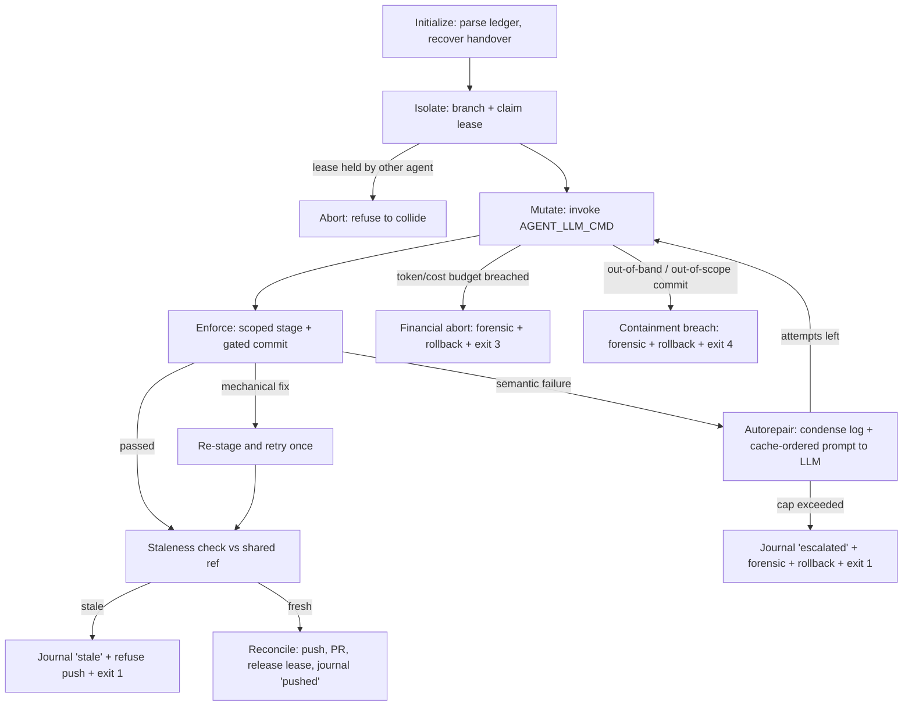

# Agent Workflow Harness

A hardened framework that keeps automated / LLM coding agents **on the rails**
using a strict five-state loop and programmatic **file-locking** enforced at
commit time. An agent may only touch the files a task explicitly declares;
everything else is locked, and the orchestrator never leaves the repository in
a half-broken state.

This README documents what is actually implemented in the repository: the
orchestrator, the file-lock and contract-binding hooks, the cross-agent
coordination layer (leases, handover journal, shared state ref, staleness
guard), the LLM-execution hardening layer (token/cost budgeting, log
condensation, cache-ordered repair prompts, escape-hatch command interception,
the human override switch, and forensic post-mortem diagnostics), and the
out-of-band containment defences (a post-hoc commit gate, a `--doctor` health
report, an optional minimal mode, and a server-side CI re-check that holds even
when the local hooks are skipped).

> **Honest threat model.** The local pre-commit hooks are the *first* line of
> defence, not the last. An LLM that spawns its own git can skip them
> (`git -c core.hooksPath=…`, low-level plumbing). The harness therefore treats
> the hooks as advisory and relies on two **authoritative** gates the agent
> cannot influence: a **post-hoc containment check** in the orchestrator
> (inspects committed history, aborts with **exit 4** on any breach) and a
> **server-side CI re-check** (`harness/ci_enforce.py`) on a trusted runner. See
> [Threat model & failure modes](#threat-model--failure-modes).

---

## Contents

- [The five-state loop](#the-five-state-loop)
- [Repository layout](#repository-layout)
- [The operational ledger (`AGENTS.md`)](#the-operational-ledger-agentsmd)
  - [Lock model](#lock-model)
- [Contract binding](#contract-binding)
- [How enforcement works](#how-enforcement-works)
- [Cross-agent coordination](#cross-agent-coordination)
- [LLM integration seam](#llm-integration-seam)
  - [Token & cost budgeting](#token--cost-budgeting)
  - [Context truncation & error condensation](#context-truncation--error-condensation)
  - [Deterministic prompt caching](#deterministic-prompt-caching)
  - [Human override switch](#human-override-switch)
- [Containment defences](#containment-defences)
  - [Post-hoc containment gate](#post-hoc-containment-gate)
  - [Server-side CI re-check](#server-side-ci-re-check)
- [Operations & diagnostics](#operations--diagnostics)
  - [Forensic post-mortem diagnostics](#forensic-post-mortem-diagnostics)
  - [Diagnostics (`--doctor`)](#diagnostics---doctor)
  - [Minimal mode](#minimal-mode)
- [Threat model & failure modes](#threat-model--failure-modes)
- [Requirements](#requirements)
- [Setup](#setup)
- [Running the orchestrator](#running-the-orchestrator)
- [The sample workload](#the-sample-workload)
- [Testing & verification](#testing--verification)
- [Pre-commit pipeline](#pre-commit-pipeline)
- [Design notes / hardening](#design-notes--hardening)
- [Extending the framework](#extending-the-framework)

---

## The five-state loop



| State | What it does |
|-------|--------------|
| **Initialize** | Open the repo, refuse a dirty tree, pull only if a tracking `origin` exists, parse `AGENTS.md`, reject an unsupported `schema_version`, generate / reuse an `AGENT_ID`, and recover the latest unresolved handover journal (locally and from the shared state ref). |
| **Isolate** | Record the current branch, compute a colon-free work-branch name, validate it with `git check-ref-format`, verify declared paths exist, then **acquire a TTL'd lease** for the task (locally and on the shared state ref) **before** creating the branch — so a lost race never leaves an orphan work branch — and only then create it. A live lease held by a different agent aborts the run. |
| **Mutate** | Dispatch on `mutation_mode` (`evolve` / `isolated`) and invoke `AGENT_LLM_CMD` — a provider-agnostic shell command — with the task context and allowlist exported as environment variables. The subprocess environment is **scoped by `AGENT_ENV_ALLOWLIST`** (comma/newline-separated names); when it is unset the seam falls back to a full copy of the parent environment and logs a one-time warning, and the active scope is recorded as an `env_scope` (`allowlisted` / `full_copy`) audit field in the forensic report and `--doctor`. The command string is then scanned by the command guard: git bypass flags (`--no-verify` / `-n`) are **stripped**, and unstrippable hook-evasion patterns (`core.hooksPath`, plumbing such as `commit-tree`/`update-ref`) are **flagged**; each guard hit charges a separate `guard_penalties` budget (its own exit-4 ceiling), not the autorepair counter. The git environment is also hardened (`GIT_CONFIG_NOSYSTEM`, dropped `GIT_CONFIG_GLOBAL`). After the run the per-step token/cost payload is read and accumulated. A no-op when `AGENT_LLM_CMD` is unset (the seam is honest about being inactive). |
| **Enforce** | Stage **only** the task's allowlist (POSIX-normalized), commit with `AGENT_TASK_ID` set so the lock / contract-binding hooks gate it, then classify the result as `passed` / `mechanical` / `semantic`. Every attempt is appended to the journal. After each step the **token/cost budget** is checked; a breach triggers an immediate financial abort (forensic report + hard rollback + exit 3). The same checkpoint enforces **time ceilings** — a per-step `AGENT_STEP_TIMEOUT_SECONDS` and a wall-clock `MAX_RUN_SECONDS` — which also exit 3 but stamp a *timeout* reason distinct from a financial/budget abort. |
| **Autorepair** | On a semantic failure, **condense** the hook log to its load-bearing assertions and build a **cache-ordered** repair prompt (static rules → task contracts → dynamic diff/log/ledger), fed to the LLM via `AGENT_REPAIR_LOG` / `AGENT_REPAIR_PROMPT_FILE`. When `max_autorepair_attempts` is exceeded, journal `escalated`, write a forensic report, **roll back** to the original branch, release the lease, and exit non-zero. |
| **Reconcile** | Run the optimistic **staleness guard** against `AGENT_SHARED_REF` (default `origin/main`); if any critical file moved since the base commit, journal `stale`, refuse the push, and exit 1. Otherwise push (when `origin` exists), open a PR via `gh` if available (or print the exact manual command), release the lease, and journal `pushed` / `local`. |

---

## Repository layout

The repository root is deliberately minimal: the only things you edit by hand
are `AGENTS.md` and your own `README.md`. You drive the framework with
`python -m harness`. Everything the framework owns — the orchestrator, the
hooks, the self-tests, the sample workload, and the harness's own documentation
(this file) — lives under `harness/`. Only the files the surrounding tooling
*requires* at the root (the pre-commit manifest, tool configs, CI workflow,
`.gitignore`) stay there.

```
dev_process/
├── AGENTS.md                          # ← EDIT THIS. Operational ledger (YAML): task definitions
├── README.md                          # ← YOUR PROJECT'S README (template ships with a sentinel;
│                                      #    replace it or run `python -m harness --init`)
├── LICENSE                            # MIT license (Copyright (c) 2026 Yuval Haim)
├── pyproject.toml                     # Packaging + ruff / mypy / pytest config (root-discovered)
├── .pre-commit-config.yaml            # Syntax/lint/type + ledger + lock + contract hooks (root-required)
├── .gitignore
├── .github/workflows/harness-ci.yml   # Trusted-runner re-check (lint/type/test + ci_enforce)
├── .harness/                          # Harness-managed coordination + run state
│   ├── contracts.lock                 # Hashed manifest of every declared contract
│   ├── leases/                        # <task_id>.json — active task leases (TTL'd)
│   ├── journal/                       # Append-only handover records per session
│   ├── telemetry/                     # Per-step usage.json + cache-ordered repair_prompt.txt (gitignored)
│   └── logs/                          # FAILED_AGENT_RUN.md forensic post-mortems (gitignored)
└── harness/                           # THE FRAMEWORK (run via `python -m harness`)
    ├── __init__.py                    # Marks `harness` as an installable package
    ├── __main__.py                    # ← `python -m harness` entry point
    ├── agent_runner.py                # Orchestrator: the 5-state loop (+ --init / --doctor)
    ├── README.md                      # This document (the framework's own docs)
    ├── lock_policy.py                 # Shared compute_allowlist() + symlink_paths() mode check + coordination bypass + human override
    ├── enforce_file_locks.py          # Pre-commit gate: aborts out-of-allowlist (and symlink) commits
    ├── validate_agents_ledger.py      # Validates AGENTS.md (incl. contracts ⊆ spec_docs)
    ├── contract_manifest.py           # verify() / update() the hashed contracts manifest
    ├── enforce_contract_binding.py    # Contract change ⇒ manifest + bound-test co-touch
    ├── leases.py                      # acquire/release/is_active task leases
    ├── journal.py                     # Start/record/finalize/write handover entries
    ├── staleness.py                   # Critical-path diff vs the shared ref
    ├── state_sync.py                  # Publish coordination state to harness-state ref
    ├── telemetry.py                   # Token/cost ledger + budget ceilings (financial abort)
    ├── log_condenser.py               # Distil tool output to failing assertions + 3-line context
    ├── prompt_builder.py              # Cache-ordered (static→dynamic) repair prompts
    ├── command_guard.py               # Strip --no-verify/-n + flag hook-evasion in AGENT_LLM_CMD
    ├── ci_enforce.py                  # Server-side authoritative file-lock + contract re-check
    ├── forensic.py                    # Write FAILED_AGENT_RUN.md audit + terminal badge
    ├── example/                       # SAMPLE WORKLOAD the framework drives & verifies
    │   ├── AGENTS.example.md          # Demo ledger that `--init --example` reproduces
    │   ├── src/
    │   │   ├── billing/
    │   │   │   ├── models.py          # PaymentRequest / PaymentResult + validation
    │   │   │   └── routes.py          # POST /payments handler (framework-agnostic)
    │   │   └── db/
    │   │       └── queries.py         # N+1 vs. batched query demo
    │   ├── docs/
    │   │   ├── API_SCHEMA.md          # POST /payments contract (example)
    │   │   └── IMPLEMENTATION.md      # Sample-app implementation notes (example)
    │   └── tests/
    │       ├── conftest.py            # Puts the flat sample-app modules on sys.path
    │       ├── test_payments.py       # Contract tests for the payments endpoint
    │       └── test_queries.py        # N+1 vs. batched behaviour tests
    └── tests/                         # FRAMEWORK SELF-TESTS
        ├── test_contracts.py          # Asserts contracts.lock matches every contract
        ├── test_harness.py            # F2–F18: framework self-tests (incl. --init/doctor, drive machine, packaging)
        └── test_hardening.py          # Telemetry, condenser, prompt, guard, forensic, override, symlink locks
```

> Everything under `harness/example/` is a **sample workload** used to exercise
> and verify the framework. The framework itself is `python -m harness` plus the
> hooks in `harness/`. To use the harness on your own project, run
> `python -m harness --init`, then point the tasks in `AGENTS.md` at your real
> files. The `harness/example/` tree can be left in place (the self-tests use it)
> or removed once you no longer need the demo.

---

## The operational ledger (`AGENTS.md`)

`AGENTS.md` holds **YAML** (despite the `.md` extension) and defines every task an
agent is allowed to run. Two example tasks ship with the project:

```yaml
schema_version: 1

tasks:
  add_payments_endpoint:
    description: >
      Add a POST /payments endpoint to the billing service.
    mutation_mode: evolve          # evolve = may edit spec_docs, tests, targets
    spec_docs:    [harness/example/docs/IMPLEMENTATION.md, harness/example/docs/API_SCHEMA.md]
    contracts:    [harness/example/docs/API_SCHEMA.md]  # stable, hash-pinned (⊆ spec_docs)
    tests:        [harness/example/tests/test_payments.py]
    contract_tests: [harness/example/tests/test_payments.py]  # pins the contract (⊆ tests)
    targets:      [harness/example/src/billing/routes.py, harness/example/src/billing/models.py]
    locked_files: []                            # AGENTS.md is ALWAYS locked implicitly
    commit_prefix: "feat"
    max_autorepair_attempts: 3
    pr_labels:    ["feature", "billing"]

  optimise_query_layer:
    description: >
      Replace N+1 patterns with batch fetches. No API contract changes.
    mutation_mode: isolated        # isolated = ONLY files in targets may change
    spec_docs:    [harness/example/docs/IMPLEMENTATION.md]
    tests:        [harness/example/tests/test_queries.py]
    targets:      [harness/example/src/db/queries.py]
    locked_files: [harness/example/docs/IMPLEMENTATION.md, harness/example/tests/test_queries.py]
    commit_prefix: "perf"
    max_autorepair_attempts: 3
    pr_labels:    ["performance"]
```

Recognised task fields: `description`, `mutation_mode`, `spec_docs`, `contracts`,
`tests`, `contract_tests`, `targets`, `locked_files`, `commit_prefix`,
`max_autorepair_attempts`, `pr_labels`. The ledger validator additionally
requires `contracts ⊆ spec_docs` and `contract_tests ⊆ tests`.

### Lock model

The allowlist is computed once, in `harness/lock_policy.py`
(`compute_allowlist`), and imported by **both** the hook and the runner so they
can never drift:

| `mutation_mode` | Allowed to change |
|-----------------|-------------------|
| `evolve`   | `targets ∪ tests ∪ spec_docs ∪ {.harness/contracts.lock}` |
| `isolated` | `targets` only |

`evolve` may intentionally revise a contract, so the hashed contract manifest
(`.harness/contracts.lock`) is co-editable in that mode. `isolated` cannot
touch the manifest, so any contract drift it causes is left to fail the
contract tests.

After computing the allowlist, anything in `locked_files` is removed, and the
**always-locked** set is removed unconditionally:

```
AGENTS.md, .pre-commit-config.yaml
```

**Coordination paths bypass the allowlist.** Files under `.harness/leases/` and
`.harness/journal/` are written and committed by the orchestrator itself
(never by the LLM mutation), so `is_coordination_path()` allows them through
the lock hook regardless of the active task.

All ledger paths must be **POSIX** (forward-slash), repo-root-relative, because
that is exactly what `git diff --cached --name-only` emits on every OS.

**Symlinks are rejected by file *mode*, not just path.** The allowlist reasons
about path strings, but an allowlisted path can be flipped from a regular file
(git mode `100644`) into a **symlink** (mode `120000`) aimed at a locked file —
keeping its permitted name while aliasing locked content. A path-only check
would wave that through. Every lock layer therefore also inspects the *resulting
git mode* via a shared `lock_policy.symlink_paths()` helper (a `--raw` diff
parse) and rejects any agent-introduced symlink outright, regardless of where it
points. Reading the mode from git's recorded tree entry — rather than
`os.path.islink` — makes the check portable and effective even against committed
history on a CI runner where the link is never materialised on disk.

---

## Contract binding

A task's `contracts` are the subset of its `spec_docs` that are treated as
**stable surface area**. Their content is hash-pinned in
`.harness/contracts.lock`, and two pre-commit hooks keep the binding honest:

- **`verify-contract-manifest`** (`harness/contract_manifest.py`) — for
  every contract declared anywhere in the ledger, the file's sha256 must match
  the manifest. A missing entry, a drifted hash, or a manifest entry for an
  undeclared contract is reported and aborts the commit. Run
  `python harness/contract_manifest.py --update` to record an intentional
  contract change.
- **`enforce-contract-binding`** (`harness/enforce_contract_binding.py`)
  — if a commit stages any contract file, the **same commit** must also stage
  `.harness/contracts.lock` and (when the task declares any) at least one of
  its `contract_tests`. This prevents a silent contract revision: the rules
  that pin the contract have to move with it.

`harness/tests/test_contracts.py` mirrors the manifest hook at test time, so a
drifted contract fails CI even when commits are bypassed.

---

## How enforcement works

`harness/enforce_file_locks.py` runs as a `pre-commit` hook:

1. If `AGENT_TASK_ID` is **not** set → exit 0. Humans committing normally are
   never gated.
2. Load `AGENTS.md`; a missing file or invalid YAML aborts cleanly with a clear
   message (no traceback).
3. Look up the task and compute its allowlist.
4. Reject any **staged symlink** outright — a `git diff --cached --raw` pass
   flags every entry whose resulting git mode is `120000`. An allowlisted path
   flipped into a symlink keeps its permitted name, so a path-only check would
   miss it; this closes the alias-to-a-locked-file bypass and **exits 1**.
5. Compare the remaining staged files (`git diff --cached --name-only`) against
   the allowlist. Any staged file outside it → print the violations and
   **exit 1**, aborting the commit.

The orchestrator sets `AGENT_TASK_ID` only for its own commit subprocess, so the
gate is active for agent commits and transparent for everyone else.

---

## Cross-agent coordination

When two or more agents may run the same harness in parallel (or on different
clones), four lightweight mechanisms keep them from colliding or losing
context:

- **Leases** (`harness/leases.py`) — Isolate writes
  `.harness/leases/<task_id>.json` with the owning `agent_id`, branch, base
  commit, declared targets, and a 3600s TTL. The file is written **atomically**
  (a sibling temp file `os.replace`d into place), so a crash mid-write never
  leaves a half-written lease. A second agent that finds a live lease held by
  someone else aborts cleanly; an expired lease may be reclaimed. Reconcile (and
  rollback) releases the lease.
- **Handover journal** (`harness/journal.py`) — every session writes an
  append-only JSON record to `.harness/journal/` containing each attempt's
  state, status, and hook-log excerpt, plus a terminal outcome
  (`in_progress` / `pushed` / `local` / `stale` / `escalated` / `error`).
  Initialize calls `latest_unresolved()` for the task and surfaces the
  previous session's context to the LLM via `AGENT_HANDOVER_FILE`, so a
  rolled-back or escalated run is never lost.
- **Shared state ref** (`harness/state_sync.py`) — leases and journal
  entries committed only on an abandoned work branch are invisible to a fresh
  clone of `main`. The orchestrator mirrors them onto a dedicated ref
  (`AGENT_STATE_REF`, default `harness-state`) via pure git plumbing
  (`read-tree` / `update-index` / `commit-tree` / `push`). The working tree
  and current branch are untouched, so it is safe to call from any state. A
  fresh clone can read coordination state directly off the ref. Pushes race, so
  `publish_files()` retries a non-fast-forward with **bounded exponential
  backoff + jitter** and returns `False` when every attempt is exhausted —
  callers treat that as a real coordination failure and **log a warning** rather
  than silently swallowing it. This is also the layer most exposed to git
  edge-cases; if you do not need cross-clone coordination, run in
  [minimal mode](#minimal-mode) to switch it off entirely.
- **Optimistic staleness guard** (`harness/staleness.py`) — before
  pushing, Reconcile diffs the **critical paths** (contracts, spec docs,
  `locked_files`, the always-locked set, and `.harness/contracts.lock`) at
  the agent's base commit against `AGENT_SHARED_REF` (default `origin/main`).
  Any difference means the shared truth moved while the agent worked; the run
  journals `stale`, refuses the push, and exits 1, handing the conflict to
  the next agent rather than landing work built on a superseded contract. On a
  **shallow clone** (common in CI) the base-commit objects may be absent, which
  would make the comparison silently pass; the guard deepens the clone first
  (`fetch --unshallow`), and when the shared ref still cannot be resolved it
  honours `AGENT_STALENESS_STRICT=1` by **failing safe** (refusing the push)
  instead of skipping the check.

## LLM integration seam

The mutation and autorepair phases dispatch to a single environment variable,
`AGENT_LLM_CMD` — any shell command. The orchestrator exports the full task
context to it so the model can edit only permitted files:

| Variable | Purpose |
|----------|---------|
| `AGENT_TASK_ID`           | Active task id (from `AGENTS.md`). |
| `AGENT_TASK_DESCRIPTION`  | Free-text description from the ledger. |
| `AGENT_MUTATION_MODE`     | `evolve` or `isolated`. |
| `AGENT_PHASE`             | `mutate` or `autorepair`. |
| `AGENT_ALLOWLIST`         | Newline-joined paths the LLM may stage. |
| `AGENT_SPEC_DOCS`         | Newline-joined declared spec docs. |
| `AGENT_TESTS`             | Newline-joined declared tests. |
| `AGENT_TARGETS`           | Newline-joined declared source targets. |
| `AGENT_CONTRACTS`         | Newline-joined contract files. |
| `AGENT_CONTRACT_TESTS`    | Newline-joined contract-binding tests. |
| `AGENT_HANDOVER_FILE`     | Path to the recovered prior-session journal (if any). |
| `AGENT_REPAIR_LOG`        | **Condensed** hook-log excerpt from the failed Enforce attempt (autorepair only). |
| `AGENT_REPAIR_PROMPT_FILE`| Path to the cache-ordered repair prompt written for this attempt (autorepair only). |
| `AGENT_TOKEN_USAGE_FILE`  | Path the command should write its per-step token/cost JSON payload to, for the budget ledger. |

When `AGENT_LLM_CMD` is unset the seam is a no-op and logs that fact —
useful for dry runs and for the framework's own tests. The subprocess
environment is scoped by **`AGENT_ENV_ALLOWLIST`** (comma/newline-separated
names); unset means a full copy of the parent environment plus a one-time
warning, and the resulting `env_scope` (`allowlisted` / `full_copy`) is surfaced
in the forensic report and `--doctor`. Before every invocation the command
string is run through the **escape-hatch guard** (`harness/command_guard.py`):
any `--no-verify` / `-n` appended to a `git commit` / `git push` segment is
stripped, the run continues with the sanitized command, and a **separate
`guard_penalties` counter** takes a penalty — it has its own exit-4 ceiling and
leaves the autorepair budget untouched, so a tamper-once agent keeps its full
repair allowance while a persistent escape attempt is still contained.

The guard is explicitly **not a security boundary**. Stripping two literal flags
only raises the cost of an *accidental* bypass; a determined agent can still skip
the hooks with `git -c core.hooksPath=…` or by writing history through plumbing
(`commit-tree` / `update-ref`). Those patterns cannot be safely rewritten out of
an arbitrary shell string, so the guard *flags* them (`GuardResult.suspicious`)
and the run is penalised — but the **authoritative** defences are the post-hoc
containment gate and the server-side CI re-check below, both of which inspect
committed history and therefore hold regardless of which git the agent ran.

### Token & cost budgeting

`harness/telemetry.py` keeps a running `TokenLedger`. After each LLM step
the runner reads the JSON payload the command wrote to `AGENT_TOKEN_USAGE_FILE`,
normalises the many provider field spellings (`input_tokens` / `prompt_tokens`,
`output_tokens` / `completion_tokens`, nested `usage` / `tool_token_usage`, …)
into one shape, and accumulates input/output/total tokens and USD cost. When a
payload omits an explicit cost it is derived from per-1K pricing. If any
configured ceiling is breached the run performs an **immediate financial abort**
— forensic report, hard `git reset --hard` rollback, journal `escalated`, and
**exit 3**.

| Variable | Purpose |
|----------|---------|
| `MAX_TOTAL_TOKENS`        | Hard ceiling on cumulative total tokens. |
| `MAX_RUN_COST_USD`        | Hard ceiling on cumulative USD cost. |
| `AGENT_COST_PER_1K_INPUT` | Per-1K input-token price used to derive cost when a payload omits it. |
| `AGENT_COST_PER_1K_OUTPUT`| Per-1K output-token price used to derive cost when a payload omits it. |
| `AGENT_TOKEN_USAGE_FILE`  | Override the default `.harness/telemetry/usage.json` sink path. |
| `AGENT_STEP_TIMEOUT_SECONDS` | Per-step ceiling on a single `AGENT_LLM_CMD` invocation; an overrun aborts with a *timeout* reason and **exit 3**. |
| `MAX_RUN_SECONDS`         | Wall-clock ceiling on the whole run; an overrun aborts with a *timeout* reason and **exit 3**. |

The same circuit-breaker also enforces the two **time** ceilings above; a
timeout shares the financial abort's exit code (3) but stamps a distinct
*timeout* reason in the forensic report. Everything degrades gracefully: a
missing file, malformed JSON, or unset budgets/timeouts yields zero usage and no
abort, so dry runs and tests stay green.

### Context truncation & error condensation

`harness/log_condenser.py` never feeds a raw multi-thousand-line dump back
to the model. It parses tool output with structural regex anchors (mypy, ruff,
pytest `E   ` assertions, `FAILED` / `ERROR` lines), strips package-manager and
summary noise, keeps the exact `file:line` references with a **3-line source
window** around each, and bounds the result. The output is ordered and
deterministic, which also makes it cache-friendly.

### Deterministic prompt caching

`harness/prompt_builder.py` assembles each repair prompt strictly
most-static → most-dynamic so provider prompt caches reuse the unchanging head
across recursive repair cycles:

1. **Static** — immutable framework rules (edit only the allowlist, never the
   always-locked files, no bypass flags, smallest change, …).
2. **Semi-static** — the task schema, allowlist arrays, and `AGENTS.md`
   boundaries.
3. **Dynamic** — the current working diff, the condensed failure log, and the
   token/cost ledger.

### Human override switch

`lock_policy.human_override_active()` returns true when `SKIP_AGENT_HARNESS` is
set to a truthy value (`1`/`true`/`yes`/`on`). When active, the file-lock and
contract-binding hooks pass immediately, letting a human make sweeping
structural or configuration changes without the autonomous-agent gates blocking
them. The agent orchestrator never sets it, and the LLM seam **strips it from
the subprocess environment** (even in full-copy mode), so a value inherited from
the parent env cannot disable the hooks for git commands the agent itself spawns.

---

## Containment defences

The pre-commit hooks are advisory — an agent that spawns its own git can skip
them. The two gates below are **authoritative** because they inspect *committed
history* instead of trusting a hook to have fired, so the usual
`git -c core.hooksPath=…` / plumbing bypasses do not defeat them.

### Post-hoc containment gate

After the mutation/repair phase and before Reconcile, the orchestrator runs
`_containment_breach()`: it inspects only **committed** state on `base..HEAD`
(the history a push would publish, so benign uncommitted scratch files are
ignored) and flags three things —

- a committed path outside the task's computed allowlist (coordination paths
  excepted),
- a committed **symlink** (any tree entry with mode `120000` on `base..HEAD`),
  even when its path is itself allowlisted — catching an allowed path aliased
  onto a locked file, and
- an **out-of-band commit** the orchestrator did not author itself (i.e. a SHA
  not in its `runner_commits` set — the signature of a hook-bypassed commit).

Any one is a breach: the run logs `CONTAINMENT BREACH`, writes a forensic
report, hard-rolls-back, journals `escalated`, and exits **4**. This is the gate
that makes the `core.hooksPath` bypass moot on the agent's own machine.

### Server-side CI re-check

`harness/ci_enforce.py` re-applies the *same* policy from a trusted runner the
agent cannot influence (wired up in `.github/workflows/harness-ci.yml`):

1. the hashed contract manifest must still verify (content-based, bypass-proof),
2. every file changed on an `agent/<task_id>/…` branch (computed over the
   aggregate `base...head` diff) must fall inside that task's allowlist
   (coordination paths excepted), and
3. no change on that branch may introduce a **symlink** — a `--raw` diff over
   the same range rejects any entry whose resulting mode is `120000`, so the
   alias-to-a-locked-file bypass is blocked remotely too.

A non-agent (human) branch only gets the manifest check; its file scope is the
reviewer's responsibility. Run it locally with
`python harness/ci_enforce.py --base <ref> --head <ref> [--task <id>]`.

---

## Operations & diagnostics

### Forensic post-mortem diagnostics

When a run is escalated, financially aborted, or crashes, `harness/forensic.py`
writes `.harness/logs/FAILED_AGENT_RUN.md` and prints a terminal status badge.
The report has four sections: (1) allowed scope vs. paths actually modified
(the containment proof), (2) terminal error codes, the condensed failing
assertions, and git policy warnings, (3) a chronological step log with token
consumption and cost per attempt, and (4) confirmation that the local working
tree was safely rolled back.

### Diagnostics (`--doctor`)

The coordination layer has several moving parts (a hashed manifest, TTL'd
leases, a handover journal, a shared git ref) and, when one misbehaves,
diagnosing it by hand means git archaeology. `python -m harness --doctor`
runs a single read-only health pass and prints, in one place:

- the repo path and whether an `origin` remote / minimal mode is in effect,
- the **contract manifest** verification result (corrupt or drifted ⇒ non-zero
  exit),
- every local **lease** with its `ACTIVE` / `expired (reclaimable)` state, owner,
  and branch (and a `PROBLEM` line for an unreadable one),
- any **unresolved handover journals** awaiting the next agent,
- whether the **shared state ref** resolves, and
- whether the root **README** is still the harness template (a soft warning,
  cleared by replacing it or running `--init`).

It performs no mutation and starts no run; it is safe to call at any time and
returns non-zero only on a hard problem (corrupt/drifted manifest, unreadable
lease) so it can gate CI.

### Minimal mode

The shared `harness-state` ref is the most failure-prone subsystem (push races,
ref divergence, shallow clones). If you run a **single agent on one clone** you
do not need it. Set `AGENT_MINIMAL=1` (or `AGENT_DISABLE_STATE_SYNC=1`) to keep
the full local file-lock + contract guarantee while skipping the cross-clone
git-plumbing entirely — leases and journals are still written locally, they are
just not mirrored to the shared ref.

---

## Threat model & failure modes

**What this framework is.** A *policy-enforcement* layer that keeps a cooperative
automation honest and contains an *erratic* one. It is **not** a sandbox: it does
not constrain what the `AGENT_LLM_CMD` process can do to the filesystem, network,
or environment. Its guarantee is narrower and verifiable — *nothing outside a
task's declared allowlist reaches a reviewed, pushed branch* — and it is enforced
in **defence-in-depth layers**, deliberately so that no single component is the
sole line of defence:

| Layer | Where it runs | Bypassable by the agent? | Role |
|-------|---------------|--------------------------|------|
| Command guard | before the LLM seam | yes (it only flags/strips) | raise the cost of an *accidental* bypass; penalise evasion |
| Pre-commit lock + contract hooks | agent's machine | yes (`core.hooksPath`, plumbing) | fast, local first line; transparent to humans |
| **Post-hoc containment gate** | orchestrator, post-commit | no (inspects committed history) | authoritative local stop — **exit 4** |
| **Server-side CI re-check** | trusted runner | no | authoritative remote stop before merge |

Because the last two layers inspect *committed history* rather than trusting the
hook to have fired, the well-known `git -c core.hooksPath=…` / `commit-tree`
bypasses do not defeat them.

### Known failure modes & how they are handled

| Failure mode | Symptom | Mitigation |
|--------------|---------|------------|
| Stale / orphaned lease | a crashed agent leaves a lease behind | TTL (3600s) makes it reclaimable; `--doctor` shows `expired`; rollback releases it |
| Corrupt `contracts.lock` | manifest file is not valid JSON | `CorruptLockError` ⇒ a clear "run `--update`" message, never a traceback; surfaced by `--doctor` and CI |
| Shared-ref push race | concurrent `publish_files` non-fast-forward | bounded exponential backoff + jitter retry; `False` return is logged as a warning, never swallowed |
| Shallow clone in CI | base-commit objects absent ⇒ staleness silently passes | auto `fetch --unshallow`; with `AGENT_STALENESS_STRICT=1`, an unresolvable ref **fails safe** |
| Hook bypass (`core.hooksPath`, plumbing) | a commit lands without the lock hook firing | guard flags it; post-hoc containment gate aborts (exit 4); CI re-check blocks the merge |
| Out-of-allowlist commit | agent commits a file it may not touch | post-hoc containment gate (exit 4) locally; `ci_enforce.py` rejects the branch remotely |
| Symlink lock bypass | an allowlisted path is flipped to a symlink (mode `120000`) aliasing a locked file | every lock layer rejects symlinks by git mode (`symlink_paths()`): pre-commit exit 1, containment gate exit 4, CI re-check fail |
| Budget breach | token/USD ceiling exceeded mid-run | immediate financial abort, rollback, forensic report, exit 3 |
| Coordination layer is overkill | single-agent run, shared-ref machinery unwanted | `AGENT_MINIMAL=1` keeps local locking, drops the shared ref |

### Honest limitations

- The `AGENT_LLM_CMD` seam is an **arbitrary shell command**. The harness hardens
  *git* behaviour around it (`GIT_CONFIG_NOSYSTEM`, dropped `GIT_CONFIG_GLOBAL`,
  flag stripping) but cannot stop the backend from doing out-of-band work outside
  that seam. The containment gate and CI re-check are what make that *safe to
  ship* — they reject the result — but they are detective controls, not a
  sandbox. Run untrusted backends inside your own isolation (container/VM).
- The shared `harness-state` ref is a coordination convenience, not a consensus
  system. Under heavy concurrency prefer one clone per agent, or
  `AGENT_MINIMAL=1`.
- The complexity is real: ~15 harness modules, a YAML ledger, a shared ref,
  TTL'd leases, a journal, a hashed manifest, and a multi-stage pre-commit
  pipeline. `--doctor` exists specifically to make that surface debuggable; if
  you do not need cross-agent coordination, minimal mode collapses most of it.

---

## Requirements

- **Python 3.12+** (uses `datetime.UTC`; ruff and mypy target `py312`).
- **Git 2.28+** (for `git init -b`; the project assumes the `main` branch).
- Python packages (declared in `pyproject.toml`):
  - runtime: `pyyaml`, `gitpython`, `pre-commit`
  - dev/verification extras (`pip install .[dev]`): `types-PyYAML`, `ruff`, `mypy`, `pytest`.
- Optional: GitHub CLI (`gh`) for automatic PR creation in Reconcile.

---

## Setup

> On Windows use `.venv\Scripts\...`; on POSIX use `.venv/bin/...`.

```bash
# 1. Initialize git on the main branch (do NOT rely on a bare `git init`)
git init -b main

# 2. Create + activate a virtualenv
python -m venv .venv
# Windows:  .venv\Scripts\activate
# POSIX:    source .venv/bin/activate

# 3. Install dependencies (the dev extra adds ruff / mypy / pytest)
pip install .[dev]

# 4. Register the pre-commit hook into local git
pre-commit install

# 5. Prime YOUR project: replace the template README + seed an empty AGENTS.md
python -m harness --init
```

> **Before you start:** the harness ships a placeholder root `README.md`
> carrying a `<!-- HARNESS_TEMPLATE_README` sentinel. `python -m harness --init`
> overwrites it with a project stub and writes an empty `AGENTS.md` skeleton
> (`tasks: {}`). `--doctor` keeps warning until the sentinel is gone, so it is
> hard to forget. Use `--init --example` to instead reproduce the bundled demo
> ledger (handy for self-checking the harness), and `--force` to overwrite an
> existing `AGENTS.md` / project README.

---

## Running the orchestrator

The framework is invoked as a module — `python -m harness` — which works both
in-place and once installed (`pip install .`). An install also exposes console
entry points — `agent-harness` (the orchestrator) and `agent-ci-enforce` (the
server-side re-check) — so `agent-harness --task …` is equivalent to
`python -m harness --task …`. The pre-commit hooks still invoke the modules by
path (`python harness/…`), so both invocation styles stay valid.

```bash
# Prime a fresh project (replace template README, seed empty AGENTS.md)
python -m harness --init

# Reproduce the bundled demo ledger instead of an empty skeleton
python -m harness --init --example

# Plan only — compute branch + staging set, never commit or push
python -m harness --task add_payments_endpoint --dry-run

# Real run for a task defined in AGENTS.md
python -m harness --task optimise_query_layer

# Health report of every coordination subsystem (no run performed)
python -m harness --doctor
```

CLI:

| Flag | Meaning |
|------|---------|
| `--task <id>` | Task id from `AGENTS.md`. Defaults to `$AGENT_TASK_ID`. |
| `--dry-run`   | Compute the branch name and staging set, log the push/PR commands, but make **no** commits, branches, or pushes. |
| `--init`      | Prime a fresh project: replace the template `README.md` with a project stub and seed an empty `AGENTS.md`, then exit. |
| `--example`   | With `--init`, seed the bundled example ledger (`harness/example/AGENTS.example.md`) instead of an empty skeleton. |
| `--force`     | With `--init`, overwrite an existing `AGENTS.md` / project `README.md`. |
| `--doctor`    | Print a one-pass [health report](#diagnostics---doctor) (manifest, leases, journals, shared ref, minimal mode, README sentinel) and exit; non-zero when a hard problem is found. |
| `--version`   | Print the harness version and exit. |
| `--list`      | List the tasks declared in `AGENTS.md` (id, mutation mode, target count) and exit. |
| `--report-json` | Print a JSON telemetry/outcome summary of the latest run (`version`, `task_id`, `outcome`, `branch`, `finished_at`, `total_tokens`, `cost_usd`) and exit. |
| `--release <id>` | Operator escape hatch: force-release a stranded lease for `<id>` (local + shared ref) and exit; prompts for confirmation unless `--yes`. |
| `--yes`       | Skip the confirmation prompt (used with `--release`). |

Exit codes:

| Code | Meaning |
|------|---------|
| `0` | Success. |
| `1` | Failure (e.g. autorepair cap exceeded, or a stale push refused); the tree is rolled back. |
| `2` | No task specified. |
| `3` | **Financial or time abort** — a token/cost budget was breached, or a step (`AGENT_STEP_TIMEOUT_SECONDS`) / wall-clock (`MAX_RUN_SECONDS`) timeout fired; the tree is rolled back and a forensic report (carrying the distinguishing reason) is written. |
| `4` | **Containment breach** — the agent committed outside its allowlist, committed a symlink (aliasing an allowlisted path onto a locked file), made an out-of-band (hook-bypassed) commit, or exhausted the `guard_penalties` ceiling with repeated git-bypass attempts; the tree is rolled back and a forensic report is written. |

Example dry-run output (remote-less repo):

```
[agent_runner] no tracking remote configured; skipping pull.
[agent_runner] initialized for task 'optimise_query_layer' (mode=isolated, agent=agent-9f3a2c10).
[agent_runner] [dry-run] computed work branch 'agent/optimise_query_layer/20260616T131752Z-3e5b1d' (not created).
[agent_runner] [mutate] isolated: source-in-targets only (LLM integration seam).
[agent_runner] [dry-run] would stage exactly: ['harness/example/src/db/queries.py']
[agent_runner] [dry-run] skipping commit to keep 'no commits created' honest.
[agent_runner] [dry-run] would run: git push -u origin agent/optimise_query_layer/20260616T131752Z-3e5b1d
[agent_runner] [dry-run] no 'origin' remote; manual push: git push -u origin agent/optimise_query_layer/20260616T131752Z-3e5b1d
```

---

## The sample workload

### Billing — `POST /payments`

`harness/example/src/billing/routes.py` exposes a framework-agnostic handler:

```python
from routes import create_payment

status, body = create_payment({"amount": 1000, "currency": "USD", "user_id": "u_1"})
# -> 201, {"transaction_id": "txn_...", "amount": 1000, "currency": "USD",
#          "user_id": "u_1", "status": "created"}
```

Contract (full details in `harness/example/docs/API_SCHEMA.md`):

- `amount` — positive integer in **minor units** (e.g. cents).
- `currency` — one of `USD`, `EUR`, `GBP`, `ILS`.
- `user_id` — non-empty string.
- Invalid/incomplete input never raises; it returns `400` with `{"error": ...}`.
- `transaction_id` is unique per call and prefixed with `txn_`.

### Query layer — N+1 vs. batched

`harness/example/src/db/queries.py` contrasts `fetch_users_n_plus_one` (one query per id) with
`fetch_users_batched` (a single query). Both return the same rows in request
order; the batched form is the optimisation target.

---

## Testing & verification

Run everything:

```bash
ruff check .
ruff format --check .
mypy --strict harness
pytest -q
```

`harness/tests/test_harness.py` verifies the **framework itself** (it builds
throwaway git repos in a temp dir):

| Group | Test | Verifies |
|-------|------|----------|
| **F2** lock hook   | `test_f2a_blocks_locked_file_in_isolated_mode`        | A locked file is rejected (exit 1, no traceback). |
| **F2**             | `test_f2b_allows_target_file`                          | An allowlisted file commits cleanly. |
| **F2**             | `test_f2c_human_bypass_without_task`                   | No `AGENT_TASK_ID` → hook passes. |
| **F2**             | `test_f2d_corrupt_ledger_aborts_cleanly`               | Broken YAML → clean error, no traceback. |
| **F2**             | `test_f2e_null_target_list_does_not_crash`             | A null `targets:` does not crash the hook. |
| **F3** orchestrator| `test_f3_dry_run_reaches_reconcile_without_commits`    | Dry-run (both tasks): no commits, no branch, manual-push hint. |
| **F4** branch/ledger | `test_f4a_computed_branch_name_is_valid`             | The work-branch name passes `git check-ref-format`. |
| **F4**             | `test_f4a_isoformat_branch_name_is_rejected`           | An `isoformat()` name (with `:` / `+`) is rejected. |
| **F4**             | `test_f4b_validator_*`                                 | Validator passes on a good ledger, fails on a corrupt one. |
| **F5** coordination| `test_f5_coordination_paths_bypass_allowlist`          | `.harness/leases/`/`.harness/journal/` are always commit-allowed. |
| **F6** binding     | `test_f6a_contract_change_without_manifest_is_blocked` | Contract change without manifest update → exit 1. |
| **F6**             | `test_f6b_contract_change_without_bound_test_is_blocked` | Contract change without a bound test → exit 1. |
| **F6**             | `test_f6c_contract_change_with_manifest_and_test_passes` | Contract + manifest + bound test in one commit → ok. |
| **F6**             | `test_f6d_non_contract_change_is_not_gated`            | Non-contract edits are not gated by the binding hook. |
| **F7** manifest    | `test_f7_manifest_detects_drift`                       | `contract_manifest.verify()` reports a drifted hash. |
| **F8** leases      | `test_f8_lease_blocks_second_agent_then_releases`      | A live lease blocks a second agent; release re-opens it. |
| **F9** journal     | `test_f9_journal_records_unresolved_for_next_agent`    | Escalated sessions are recoverable via `latest_unresolved()`. |
| **F10** staleness  | `test_f10_staleness_detects_moved_contract`            | A contract moved on the shared ref is reported as stale. |
| **F11** state sync | `test_f11_state_sync_round_trips_across_clones`        | Coordination state pushed to the shared ref is readable from a fresh clone. |
| **F12** state sync | `test_f12_publish_files_returns_false_on_unreachable_remote` | A push that cannot reach its remote returns `False` (no silent swallow). |
| **F13** manifest   | `test_f13_corrupt_lock_reports_cleanly`               | A corrupt `contracts.lock` yields an actionable message, not a traceback. |
| **F14** CI re-check| `test_f14a/b_ci_enforce_*_agent_branch`               | `ci_enforce.py` blocks an out-of-scope agent branch and passes an in-scope one. |
| **F15** bootstrap  | `test_f15a_init_writes_empty_skeleton_that_validates` | `--init` writes a project README + an empty `AGENTS.md` skeleton that validates. |
| **F15**            | `test_f15b_init_example_recreates_shipped_ledger`     | `--init --example` reproduces the shipped example ledger byte-for-byte. |
| **F15**            | `test_f15c_doctor_flags_template_readme_then_init_clears_it` | `--doctor` warns on the template README; `--init` clears the sentinel. |
| **F16** drive loop | `test_f16a–h_*`                                        | The `run_drive` state machine, exercised with fakes: `passed`/`dry-run` reconcile, a single mechanical retry, post-mutate/post-repair aborts (exit 3/4), the autorepair cap (exit 1), and post-pass containment (exit 4). |
| **F17** CLI        | `test_f17a–d_*`                                        | `--version`, `--list`, `--report-json` (valid JSON with the expected keys), and `--release` clearing a local lease. |
| **F18** packaging  | `test_f18_editable_install_exposes_console_script`    | An editable install exposes the `agent-harness` console entry point. |

`harness/tests/test_hardening.py` covers the LLM-execution hardening layer: token-usage
normalisation and budget aborts (telemetry), log condensation, cache-ordered
prompt assembly, bypass-flag stripping **and hook-evasion flagging** (command
guard), the `SKIP_AGENT_HARNESS` override, forensic-report generation, an
end-to-end financial-abort run that asserts the exit-3 path rolls back and writes
`FAILED_AGENT_RUN.md`, and an end-to-end **containment-breach** run (H8) where an
LLM that commits an out-of-band file via a hook bypass is caught by the post-hoc
gate and aborts with **exit 4** plus a clean rollback. A dedicated **symlink
bypass** group (H8b) covers the mode-aware lock: the `symlink_paths()` `--raw`
parser, the pre-commit hook blocking an allowlisted path staged as a symlink to a
locked file (exit 1), and the post-hoc gate reporting a committed symlink as a
breach even when its path is itself allowlisted.

`harness/tests/test_contracts.py::test_contracts_match_manifest` additionally asserts
that the shipped `.harness/contracts.lock` matches every declared contract.

The remaining tests (`test_payments.py`, `test_queries.py`) cover the sample
workload's contracts.

---

## Pre-commit pipeline

`.pre-commit-config.yaml` runs, in order:

1. **Syntax/format** — merge-conflict, `check-yaml` (`.yaml`/`.yml`), `check-json`
   (`.json`), large-file guard (`--maxkb=500`), trailing-whitespace,
   end-of-file-fixer.
2. **Lint & types** — `ruff` (`--fix`), `ruff-format`, `mypy --strict harness`.
3. **Ledger integrity, file locks & contract binding** —
   - `validate-agents-ledger` (because `check-yaml` skips the `.md`-extensioned
     `AGENTS.md`),
   - `enforce-file-locks` (no staged file may fall outside the task's allowlist,
     and no staged entry may be a symlink),
   - `verify-contract-manifest` (every declared contract still matches
     `.harness/contracts.lock`),
   - `enforce-contract-binding` (a staged contract change must co-stage the
     manifest and a bound test).

---

## Design notes / hardening

- **Allowlist, not denylist** — anything not explicitly permitted is blocked.
- **Scoped staging** — the runner stages only allowlisted paths, so stray
  artifacts and locked files can never enter the index.
- **Colon-free branch stamps** — `strftime("%Y%m%dT%H%M%SZ")`, because
  `isoformat()` emits `:`/`+`, which `git check-ref-format` rejects.
- **No-remote tolerant** — Initialize and Reconcile both guard on `origin`, so a
  fresh, remote-less repo never crashes.
- **Honest reconcile** — a PR is opened via `gh` or an exact manual command is
  printed; the framework never falsely claims a PR was created.
- **Mechanical vs. semantic** — a failed commit is classified by inspecting
  whether an auto-fixer **dirtied the worktree** (not by string-matching English
  hook wording); a mechanical rewrite triggers a single re-stage+retry and does
  **not** consume an autorepair attempt.
- **Single source of truth** — `compute_allowlist()` is imported by both the hook
  and the runner to prevent policy drift.
- **Always-locked** — `AGENTS.md` and `.pre-commit-config.yaml` can never be
  modified by an agent task.
- **Symlink-aware locks** — the path allowlist is backed by a file-*mode* check
  (`lock_policy.symlink_paths()`): every lock layer (pre-commit, post-hoc
  containment gate, CI re-check) rejects any agent-introduced symlink (git mode
  `120000`) so an allowlisted path cannot be aliased onto a locked file. Mode is
  read from git's recorded tree entry, not `os.path.islink`, so it holds against
  committed history on a CI runner.
- **Financial & time circuit-breaker** — cumulative token and USD budgets are
  checked after every LLM step, alongside per-step (`AGENT_STEP_TIMEOUT_SECONDS`)
  and wall-clock (`MAX_RUN_SECONDS`) time ceilings; a breach hard-rolls-back and
  exits 3 (with a reason distinguishing a budget breach from a timeout) before
  more spend.
- **Lean repair context** — raw tool dumps are condensed to failing assertions
  with a 3-line window, keeping the autorepair loop token-efficient.
- **Cache-ordered prompts** — repair prompts are assembled static→dynamic to
  maximise provider prompt-cache hits across recursive repairs.
- **Escape-hatch interception** — `--no-verify` / `-n` on a spawned `git commit`
  / `git push` are stripped and charged to a dedicated `guard_penalties` budget
  (separate from the autorepair counter, with its own exit-4 ceiling), and
  unstrippable hook-evasion (`core.hooksPath`, plumbing) is flagged. This raises
  the cost of a bypass but is **not** a security boundary; the authoritative
  defences are the post-hoc containment gate and the server-side CI re-check.
- **Scoped LLM environment** — `AGENT_ENV_ALLOWLIST` restricts which parent env
  vars reach the seam; unset means a full copy plus a one-time warning, and the
  active `env_scope` is surfaced in forensics and `--doctor`. `SKIP_AGENT_HARNESS`
  is always dropped from the seam so the human override cannot be inherited.
- **Post-hoc containment gate** — after mutation the orchestrator inspects
  committed history (`base..HEAD`); any out-of-allowlist, symlink, or
  out-of-band (hook-bypassed) commit triggers a forensic rollback and **exit
  4**, so a skipped local hook cannot smuggle work onto the branch.
- **Server-side re-enforcement** — `harness/ci_enforce.py` re-applies the
  allowlist + manifest check from a trusted CI runner the agent cannot influence.
- **Git-environment hardening** — the LLM seam runs with `GIT_CONFIG_NOSYSTEM`
  set and `GIT_CONFIG_GLOBAL` dropped, so stray git config cannot weaken the
  gates mid-run.
- **Fail-safe coordination** — `publish_files()` retries with backoff + jitter
  and surfaces failures (never silent); staleness deepens shallow clones and
  honours `AGENT_STALENESS_STRICT`.
- **Diagnosability** — `--doctor` reports the health of every coordination
  subsystem in one pass; `AGENT_MINIMAL=1` drops the shared-ref machinery for
  simple single-agent runs.
- **Human override** — `SKIP_AGENT_HARNESS=1` lets a developer bypass the gates
  for sweeping manual changes; the orchestrator never sets it and the LLM seam
  strips it from the subprocess env, so it cannot be inherited into
  agent-spawned git commands.
- **Forensic containment** — a rejected/crashed run leaves a transparent
  `.harness/logs/FAILED_AGENT_RUN.md` and a terminal badge, with the working
  tree verified clean.

---

## Extending the framework

- **Add a task** — add an entry under `tasks:` in `AGENTS.md` and run
  `validate-agents-ledger` (or commit) to confirm it parses.
- **Wire in an LLM** — implement the body of `mutate()` (and the fix step inside
  `autorepair()`) in `harness/agent_runner.py`; everything around those seams
  already handles isolation, enforcement, classification, rollback, and reconcile.
