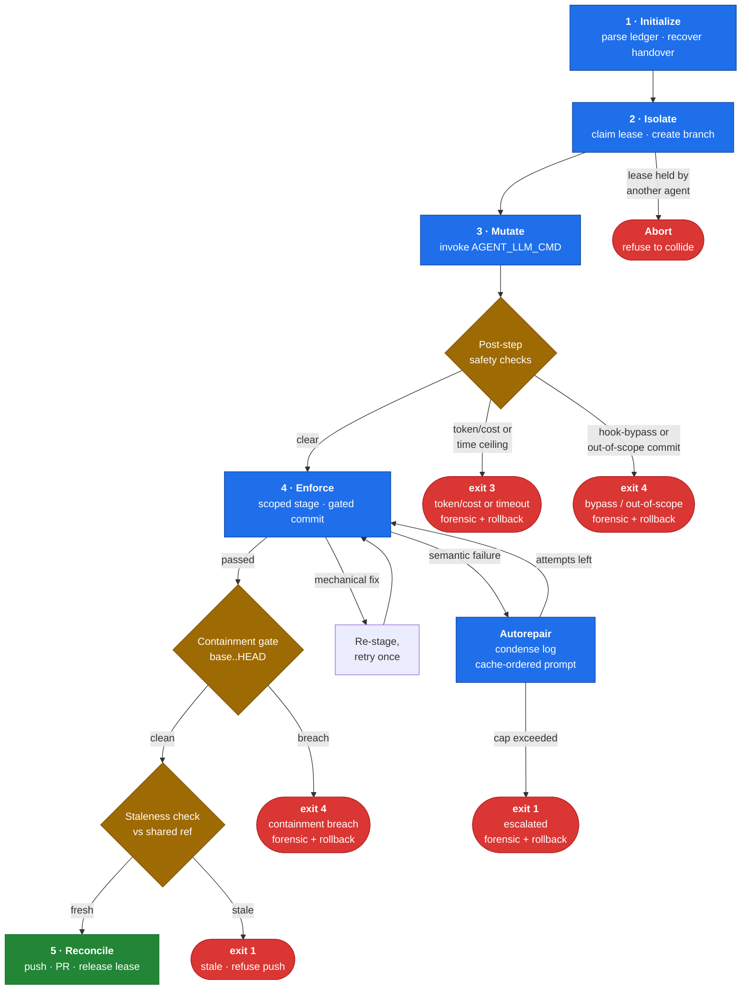

# Overview & architecture

> **Relevant source:** [`../runner_states.py`](../runner_states.py),
> [`../runner_drive.py`](../runner_drive.py),
> [`../runner_recovery.py`](../runner_recovery.py),
> [`../runner_reconcile.py`](../runner_reconcile.py),
> [`../runner_containment.py`](../runner_containment.py),
> the ledger [`../../AGENTS.md`](../../AGENTS.md).

## The problem it solves

**The problem.** An autonomous / LLM coding agent turned loose on your
repository can edit files it was never meant to touch, silently change a stable
API, or leave the working tree half-broken when it fails mid-task.

**The solution.** You declare, *per task*, exactly which files an agent may
change. Everything else is locked. The rules are enforced three times — when the
agent commits, again on the committed history right after, and a third time in
CI — so nothing out of scope can reach a merged branch.

> **The guarantee:** *nothing outside a task's declared allowlist reaches a
> reviewed, pushed branch.*

**Who this is for**

- **Use it** if you run automated / LLM agents against a real repository and
  need hard, verifiable limits on what they may change.
- **You may not need it** if you only run a single trusted agent on a throwaway
  branch — [minimal mode](containment-and-diagnostics.md#minimal-mode) collapses most of the machinery.
- **It is not a sandbox.** It constrains what reaches a branch, not what the
  agent process can do to your machine — run untrusted backends in a
  container / VM.

## How it works in 5 steps

1. **Declare** a task's file scope in `AGENTS.md` — its `targets`, `tests`, and
   `spec_docs`.
2. **Isolate** — the harness claims a TTL'd lease and cuts a dedicated work
   branch.
3. **Mutate** — it invokes your agent (`AGENT_LLM_CMD`) to edit *only* the
   allowed files.
4. **Enforce** — it stages just the allowlist and commits behind the lock /
   contract hooks, auto-repairing test failures within a budget.
5. **Reconcile** — it re-inspects the committed history, guards against a moved
   base branch, then pushes and opens a PR.

The full state machine — including the abort, budget, and repair paths — is the
[five-state loop](#the-five-state-loop) below.

## Key concepts

| Term | In one line |
|------|-------------|
| **Ledger (`AGENTS.md`)** | YAML file where each task declares the files an agent may touch. |
| **Allowlist** | The exact set of paths a task may change; everything else is locked. |
| **`evolve` / `isolated`** | Task modes: `evolve` may edit specs + tests + targets; `isolated` only targets. |
| **Lease** | A short-lived claim on a task so two agents never work it at once. |
| **Handover journal** | An append-only record of each run, recovered by the next agent. |
| **Contract** | A stable spec doc, hash-pinned; changing it must co-change a bound test. |
| **OKF** | [Open Knowledge Format](https://github.com/GoogleCloudPlatform/knowledge-catalog/blob/main/okf/SPEC.md) — the frontmatter standard the `spec_docs` follow. |
| **Containment gate** | Post-commit check of committed history; aborts (**exit 4**) on any breach. |
| **Staleness guard** | Refuses to push if the shared branch moved under the agent's feet. |
| **`--doctor`** | Read-only health report across every coordination subsystem. |

## The five-state loop



**Exit codes.** The diagram shows the terminal states of the loop itself. The
full set the orchestrator can return:

- **`0`** — success (`pushed`, `local`, or a `--dry-run` plan).
- **`1`** — soft stop: autorepair cap `escalated`, staleness-`refused push`, a
  recoverable `error` (push failed / unhandled exception), or an operator-aborted
  `--release`.
- **`2`** — **CLI usage error**, raised in `main()` *before* the loop starts (no
  `--task` / `AGENT_TASK_ID`, or an unsafe id passed to `--release`). This is why
  `2` never appears among the loop terminals above.
- **`3`** — budget or time-ceiling abort (`BUDGET_ABORT_EXIT`; a timeout stamps a
  distinct reason but shares the code).
- **`4`** — containment breach (`CONTAINMENT_ABORT_EXIT`).

| State | What it does |
|-------|--------------|
| **Initialize** | Open the repo, refuse a dirty tree, pull only if a tracking `origin` exists, parse `AGENTS.md`, reject an unsupported `schema_version`, generate / reuse an `AGENT_ID`, and recover the latest unresolved handover journal (locally and from the shared state ref). |
| **Isolate** | Record the current branch, compute a colon-free work-branch name, validate it with `git check-ref-format`, verify declared paths exist, then **acquire a TTL'd lease** for the task (locally and on the shared state ref) **before** creating the branch — so a lost race never leaves an orphan work branch — and only then create it. A live lease held by a different agent aborts the run. |
| **Mutate** | Dispatch on `mutation_mode` (`evolve` / `isolated`) and invoke `AGENT_LLM_CMD` — a provider-agnostic shell command — with the task context and allowlist exported as environment variables. The subprocess environment is **scoped by `AGENT_ENV_ALLOWLIST`** (comma/newline-separated names); when it is unset the seam falls back to a full copy of the parent environment and logs a one-time warning, and the active scope is recorded as an `env_scope` (`allowlisted` / `full_copy`) audit field in the forensic report and `--doctor`. The command string is then scanned by the command guard: git bypass flags (`--no-verify` / `-n`) are **stripped** when `git` is a clean token, and unstrippable evasion patterns are **flagged** — `core.hooksPath`, plumbing such as `commit-tree`/`update-ref`, and a bypass flag riding on an *obfuscated* git commit/push where `git` is hidden behind command substitution (`$(git commit --no-verify)`), backticks, or a shell variable (`$GIT commit --no-verify`), or the mirror case where `git` stays clean but the *flag* is hidden — wrapped in a command substitution (`git commit -m x $(echo --no-verify)`) or routed through a shell variable (`FLAG=--no-verify; git commit … $FLAG`) — so the stripper cannot reach it; each guard hit charges a separate `guard_penalties` budget (its own exit-4 ceiling), not the autorepair counter. The git environment is also hardened (`GIT_CONFIG_NOSYSTEM`, and the inherited git-config env family dropped: `GIT_CONFIG_GLOBAL` / `GIT_CONFIG_SYSTEM` / `GIT_CONFIG_PARAMETERS` / `GIT_CONFIG_COUNT` / `GIT_CONFIG_KEY_*` / `GIT_CONFIG_VALUE_*`). After the run the per-step token/cost payload is read and accumulated. A no-op when `AGENT_LLM_CMD` is unset (the seam is honest about being inactive). |
| **Enforce** | Stage **only** the task's allowlist (POSIX-normalized), commit with `AGENT_TASK_ID` set so the lock / contract-binding hooks gate it, then classify the result as `passed` / `mechanical` / `semantic`. Every attempt is appended to the journal. After each step the **token/cost budget** is checked; a breach triggers an immediate financial abort (forensic report + hard rollback + exit 3). The same checkpoint enforces **time ceilings** — a per-step `AGENT_STEP_TIMEOUT_SECONDS` and a wall-clock `MAX_RUN_SECONDS` — which also exit 3 but stamp a *timeout* reason distinct from a financial/budget abort. |
| **Autorepair** | On a semantic failure, **condense** the hook log to its load-bearing assertions and build a **cache-ordered** repair prompt (static rules → task contracts → dynamic diff/log/ledger), fed to the LLM via `AGENT_REPAIR_LOG` / `AGENT_REPAIR_PROMPT_FILE`. This step **is** the repair LLM call; afterwards the loop re-enters **Enforce** directly (it does **not** re-run Mutate), so each repair cycle costs exactly one LLM invocation. When `max_autorepair_attempts` is exceeded, journal `escalated`, write a forensic report, **roll back** to the original branch, release the lease, and exit non-zero. |
| **Reconcile** | Run the optimistic **staleness guard** against `AGENT_SHARED_REF` (default `origin/main`); if any critical file moved since the base commit, journal `stale`, refuse the push, and exit 1. Otherwise push (when `origin` exists), open a PR via `gh` if available (or print the exact manual command), release the lease, and journal `pushed` / `local`. If the push itself fails after a clean local run, the journal is re-finalized to a **recoverable `error`** outcome (the work stays committed locally on the branch and the lease is already released), so re-running the task retries the push instead of stranding the run on a misleading `pushed` state. |

## Repository layout

The repository root is deliberately minimal: the only things you edit by hand
are `AGENTS.md` and your own `README.md`. You drive the framework with
`python -m harness`. Everything the framework owns — the orchestrator, the
hooks, the self-tests, the sample workload, and the harness's own documentation
(this file) — lives under `harness/`. Only the files the surrounding tooling
*requires* at the root (the pre-commit manifest, tool configs, CI workflow,
`.gitignore`) stay there.

```
dev_process/
├── AGENTS.md                          # ← EDIT THIS. Operational ledger (YAML): task definitions
├── README.md                          # ← YOUR PROJECT'S README (template ships with a sentinel;
│                                      #    replace it or run `python -m harness --init`)
├── LICENSE                            # MIT license (Copyright (c) 2026 Yuval Haim)
├── pyproject.toml                     # Packaging + ruff / mypy / pytest config (root-discovered)
├── .pre-commit-config.yaml            # Syntax/lint/type + ledger + lock + contract hooks (root-required)
├── .gitattributes                     # Normalises EOL to LF so contract hashes match cross-OS
├── .gitignore
├── .github/                           # Community health + trusted-runner CI
│   ├── workflows/harness-ci.yml       # Trusted-runner re-check (lint/type/test + ci_enforce)
│   ├── SECURITY.md                    # Private vulnerability-reporting policy
│   ├── CONTRIBUTING.md                # Contribution + local-check guide
│   └── CODE_OF_CONDUCT.md             # Contributor Covenant v2.1
├── .harness/                          # Harness-managed coordination + run state
│   ├── contracts.lock                 # Hashed manifest of every declared contract
│   ├── leases/                        # <task_id>.json — active task leases (TTL'd)
│   ├── journal/                       # Append-only handover records per session
│   ├── telemetry/                     # Per-step usage.json + cache-ordered repair_prompt.txt (gitignored)
│   └── logs/                          # FAILED_AGENT_RUN.md + OKF postmortems/ + log.md memory (gitignored)
└── harness/                           # THE FRAMEWORK (run via `python -m harness`)
    ├── __init__.py                    # Marks `harness` as an installable package
    ├── __main__.py                    # ← `python -m harness` entry point
    ├── agent_runner.py                # Thin facade: re-exports the runner_* surface (entry point)
    ├── runner_core.py                 # Data models (TaskSpec/RunContext), ledger parsing, shared helpers
    ├── runner_llm.py                  # The LLM integration seam (_run_llm) + hardened subprocess env
    ├── runner_states.py               # States 1-4: initialize, isolate, mutate, enforce
    ├── runner_recovery.py             # Rollback, forensics, circuit-breakers, autorepair step
    ├── runner_containment.py          # Post-hoc committed-state containment gate (base..HEAD probes)
    ├── runner_reconcile.py            # State 5: honest reconcile, staleness guard, PR open
    ├── runner_drive.py                # Drive model: the outer mutate/enforce/autorepair loop
    ├── runner_cli.py                  # argparse CLI, --init/--doctor, report_json, release-lease
    ├── README.md                      # Documentation hub (links into this docs/ folder)
    ├── lock_policy.py                 # Shared compute_allowlist() + symlink_paths() mode check + coordination bypass + human override
    ├── ledger.py                      # Shared AGENTS.md loader (load_ledger/get_task/LedgerError) for hooks, runner & CI
    ├── git_blob.py                    # Shared read_blob(): a path's content at a git ref (staleness/CI/containment)
    ├── hook_context.py                # Shared gated-hook preamble (override/skip/resolve task) + staged-files reader
    ├── enforce_file_locks.py          # Pre-commit gate: aborts out-of-allowlist (and symlink/gitlink) commits
    ├── validate_agents_ledger.py      # Validates AGENTS.md (incl. contracts ⊆ spec_docs, spec_docs are .md concepts)
    ├── okf.py                         # OKF conformance for the spec_docs info layer (type gate + reserved-file rules)
    ├── validate_okf.py                # Pre-commit gate: every declared spec_doc is an OKF concept
    ├── contract_manifest.py           # verify() / update() the hashed contracts manifest
    ├── enforce_contract_binding.py    # Contract change ⇒ manifest + bound-test co-touch
    ├── leases.py                      # acquire/release/is_active task leases
    ├── journal.py                     # Start/record/finalize/write handover entries
    ├── staleness.py                   # Critical-path diff vs the shared ref
    ├── state_sync.py                  # Publish coordination state to harness-state ref
    ├── telemetry.py                   # Token/cost ledger + budget ceilings (financial abort)
    ├── log_condenser.py               # Distil tool output to failing assertions + 3-line context
    ├── prompt_builder.py              # Cache-ordered (static→dynamic) repair prompts
    ├── command_guard.py               # Strip --no-verify/-n + flag hook-evasion in AGENT_LLM_CMD
    ├── ci_enforce.py                  # Server-side authoritative file-lock + contract re-check
    ├── forensic.py                    # Write FAILED_AGENT_RUN.md audit + terminal badge
    ├── example/                       # SAMPLE WORKLOAD the framework drives & verifies
    │   ├── AGENTS.example.md          # Demo ledger that `--init --example` reproduces
    │   ├── src/
    │   │   ├── billing/
    │   │   │   ├── models.py          # PaymentRequest / PaymentResult + validation
    │   │   │   └── routes.py          # POST /payments handler (framework-agnostic)
    │   │   └── db/
    │   │       └── queries.py         # N+1 vs. batched query demo
    │   ├── docs/                      # OKF concept bundle (each file has YAML frontmatter)
    │   │   ├── index.md               # OKF bundle root (okf_version) + progressive-disclosure listing
    │   │   ├── API_SCHEMA.md          # POST /payments contract concept (type: API Contract)
    │   │   ├── IMPLEMENTATION.md      # Sample-app implementation notes (type: Implementation Notes)
    │   │   └── log.md                 # OKF reserved history file (dated, newest-first)
    │   └── tests/
    │       ├── conftest.py            # Puts the flat sample-app modules on sys.path
    │       ├── test_payments.py       # Contract tests for the payments endpoint
    │       └── test_queries.py        # N+1 vs. batched behaviour tests
    └── tests/                         # FRAMEWORK SELF-TESTS
        ├── test_contracts.py          # Asserts contracts.lock matches every contract (+ whole-file hash covers frontmatter)
        ├── test_okf.py                # OKF conformance: type gate, reserved-file rules, contract no-timestamp
        ├── test_harness.py            # F2–F18: framework self-tests (incl. --init/doctor, drive machine, packaging)
        ├── test_hardening.py          # Telemetry, condenser, prompt, guard, forensic, override, symlink/gitlink + OKF locks
        ├── test_git_blob.py           # read_blob() at a ref: present / absent / git-error paths
        └── test_telemetry_env.py      # _env_float parsing: defaults, overrides, malformed values
```

> Everything under `harness/example/` is a **sample workload** used to exercise
> and verify the framework. The framework itself is `python -m harness` plus the
> hooks in `harness/`. To use the harness on your own project, run
> `python -m harness --init`, then point the tasks in `AGENTS.md` at your real
> files. The `harness/example/` tree can be left in place (the self-tests use it)
> or removed once you no longer need the demo.
